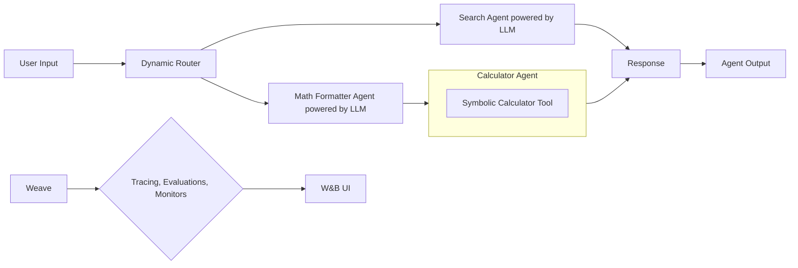

# AI Agent with LangChain and Weights & Biases (W&B) Weave

## Overview

This project demonstrates a sophisticated AI agent built with LangChain, leveraging Weights & Biases (W&B) Weave for comprehensive observability, monitoring, and rigorous evaluation. The agent solves mathematical problems using a multi-agent system with fallback capabilities, featuring seamless Weave integration for tracing, evaluation, and monitoring.

## Key Features
- Multi-Agent System: Two-agent strategy with dynamic routing:
    - Math Formatter Agent: Converts natural language to mathematical expressions
    - Calculator Agent: Performs precise calculations using Python evaluation
    - Search Agent: Mimics Google Search Engine with LLM
- Comprehensive Weave Instrumentation: Real-time tracing, evaluations, and monitors
- Automated Evaluation Suite: Parametrically generated problems for accuracy measurement
- Centralized W&B Integration: Complete observability in W&B UI

## Architecture



## Why Weave?
Weights & Biases Weave transforms how you monitor and evaluate AI agents by providing:

🔍 Deep Tracing
- Complete execution flow capture including reasoning steps
- Tool call tracking and agent decision logs
- Full audit trail of all agent activities
- Visual execution graphs for debugging and optimization

📊 Automated Evaluation
- Built-in evaluation framework with custom scorers
- Parametric problem generation for comprehensive testing
- Performance metrics and accuracy tracking
- Automated regression testing capabilities

🚨 Real-time Monitoring
- Latency tracking and performance metrics
- Success rate and error rate monitoring
- Custom alerting and anomaly detection
- Centralized dashboard for all agent activities

## Implementation Details

### Core Agent Architecture

The agent utilizes LangChain's AgentExecutor with:
- Custom Tools: Python-based calculator for precise computations
- Memory Management: `ConversationBufferMemory` for context preservation
- LLM Backend: Ollama for local LLM flexibility and control

### Agent Logic
- Math Formatter Agent: Natural language → Mathematical expressions
- Calculator Agent: Mathematical expressions → Precise results
- Search Agent: General question → Search results
- Dynamic Routing: Intelligent agent selection
- Tracing: Full execution flow capture with reasoning and tool calls
- Evaluations: Automated accuracy testing with custom scorers
- Monitors: Performance metrics and error tracking

## Setup Instructions

### Prerequisites

* **Ollama:**  Install Ollama to run the local LLM.  [https://ollama.com/download](https://ollama.com/download)
* **Start Ollama Server:** `ollama serve`
* **Pull LLM:** `ollama pull gemma3:4b` (or your preferred LLM)

### Installation

1. **Create a Virtual Environment:**

   ```bash
   python -m venv venv
   source venv/bin/activate  # On Windows: venv\Scripts\activate

2. **Install Dependencies:**

    ```bash
    pip install -r requirements.txt
    ```

### Environmental Variables

- Create a `.env` file from the `.env_template` and set the following variables:

```
LANGCHAIN_TRACING_V2= "true"
LANGCHAIN_PROJECT = "ai-agent-demo"
LANGCHAIN_API_KEY = "<YOUR_LANGCHAIN_API_KET_FOR_LANGSMITH>"
WANDB_API_KEY = "<YOUR_WANDB_API_KEY>"
```

### IDE
Use VSCode with the Python extension. A `.vscode/launch.json` file is provided for debugging.

## Running the Agent
Before running, ensure Ollama is running and you've pulled your desired LLM.

1. **Evaluation Mode:** Runs the agent on a suite of generated problems to evaluate its accuracy.

    ```bash
    python agent.py --evaluation --num_problems 6
    ```

2. **Interactive Mode:** Allows you to interact with the agent in a conversational manner.

    ```bash
    python agent.py --interactive
    ```

3. **Single Question:** Processes a single question and prints the answer.

    ```bash
    python agent.py --question "What is 15 plus 27?"
    ```

4. **Batch Processing from File:** Processes questions from a file (one question per line).

    Create a file called `questions.txt`:

        ```txt
        What is 15 plus 27?
        Calculate 100 minus 45
        What is 12 times 8?
        Divide 100 by 4
        ```

    Then run:

        ```bash
        python agent.py --file questions.txt
        ```

📈 Execution Tracing
- Visual execution flow diagrams
- Step-by-step reasoning breakdown
- Tool call visualization
- Performance bottlenecks identification

🧪 Evaluation Dashboard
- Accuracy metrics and trends
- Automated test results
- Comparison between agent versions
- Regression testing capabilities

📊 Monitoring Console
- Real-time performance metrics
- Error rate tracking
- Latency analysis
- Custom alert configurations

## Benefits of This Approach
- Production-Ready Observability: Comprehensive monitoring from day one
- Rapid Debugging: Visual execution traces simplify troubleshooting
- Data-Driven Improvements: Evaluation metrics guide agent optimization
- Reproducible Results: Full tracing enables consistent testing
- Centralized Management: Single dashboard for all agent activities
- Scalable Architecture: Easy to extend with additional agents or tools
- This implementation demonstrates how Weave transforms AI agent development from a black box into a transparent, measurable, and continuously improving system.